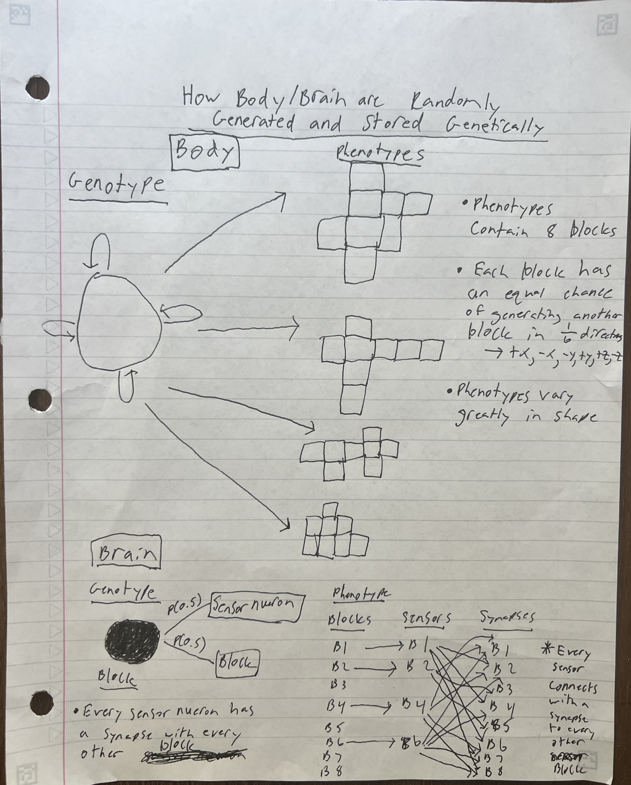
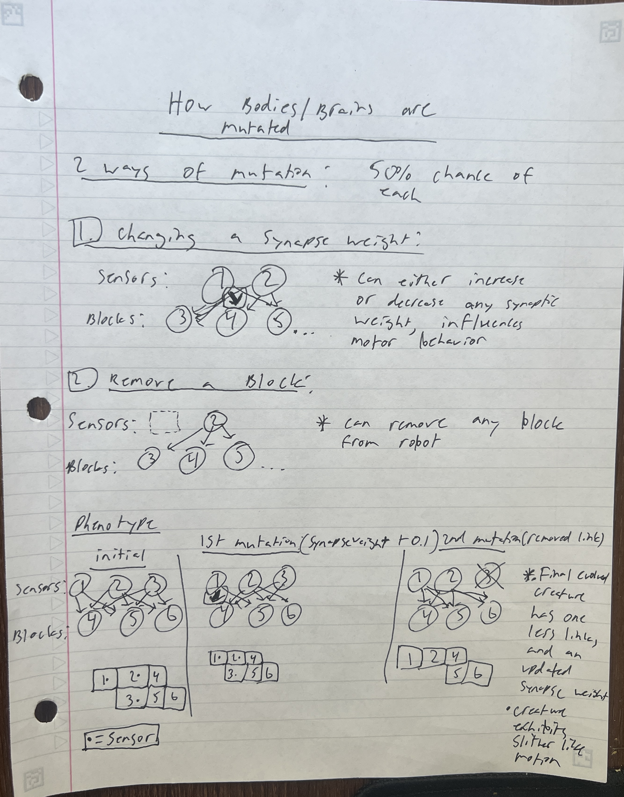
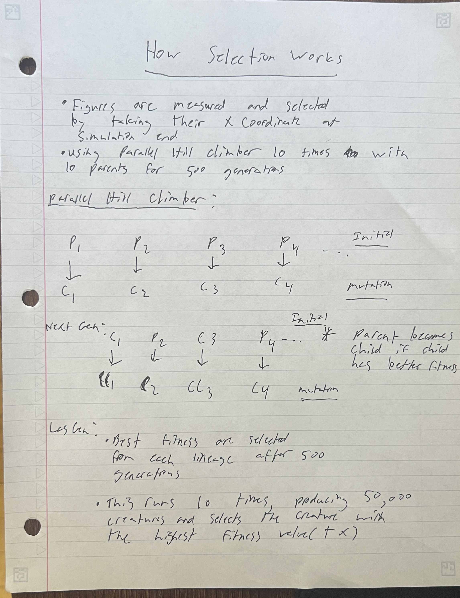

Dear Grader,

I have spent more hours than I can possibly count developing this code,
and I am very proud of my work. I have taken the Engineer Route for my project.
 I hope you enjoy my final project :)

1. Summary Video:

2. Teaser Gif:

3. Methods:
-This project successfully simulates evolution in a virtual environment
-Specifically, 50 parents are generated and evolved for 500 generations. This simulation is done 10 times for a total of 50,000 creatures
-50,000 3D creatures made of 1x1x1 blocks are generated, mutated, and selected using the Paralel Hill Climber class
-To reproduce my final evolved creature, simply run the 'reRunBest.py'
-To evolve a new creature, run 'main.py'

    *How Body/Brains are Randomly Generated:
    
    
    *How Body/Brains are Mutated:
    

    *How Selection Works:
    
    
4. Results