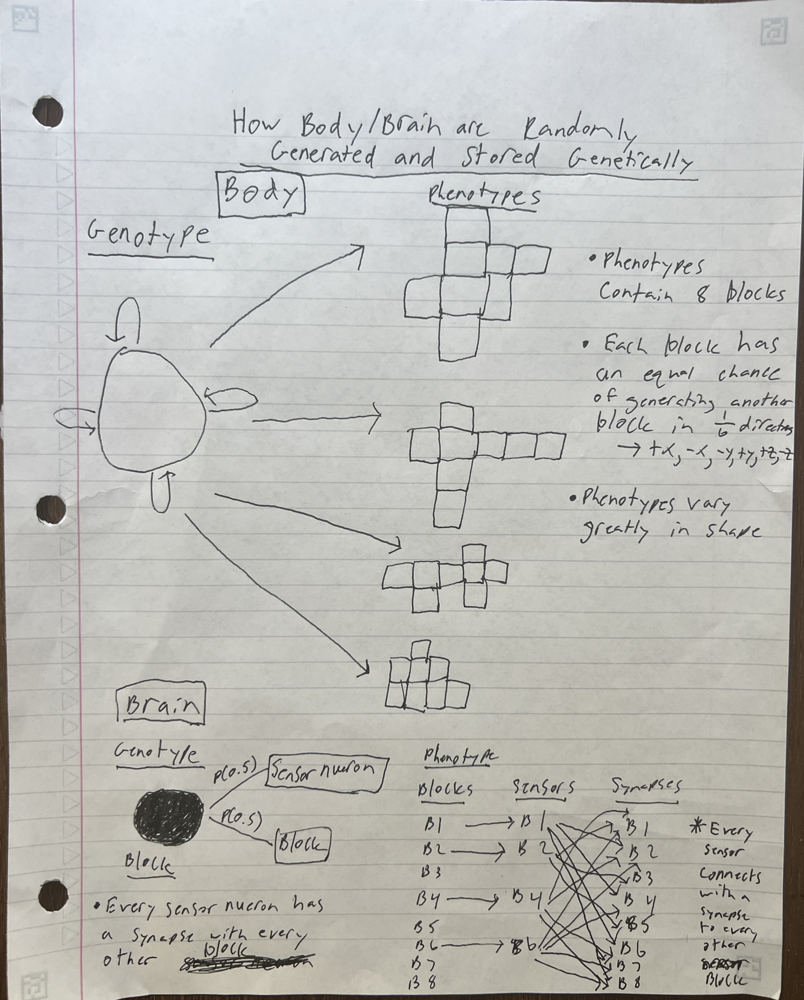
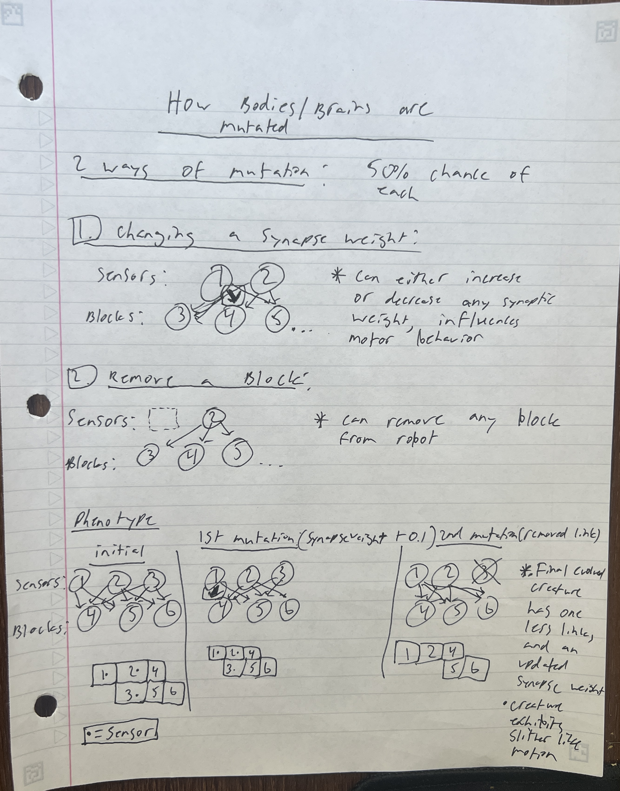
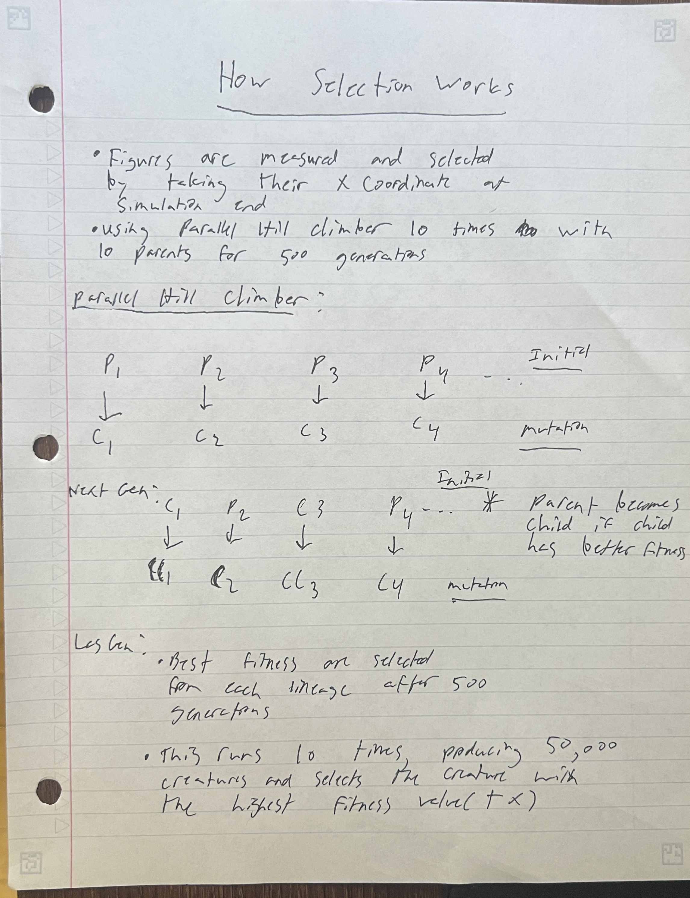

Dear Grader,

I have spent more hours than I can possibly count developing this code,
and I am very proud of my work. I have taken the Engineer Route for my project.
 I hope you enjoy my final project :)

1. Summary Video:
Enjoy!

2. Teaser Gif:

3. Methods:
-This project successfully simulates evolution in a virtual environment
-Specifically, 50 parents are generated and evolved for 500 generations. This simulation is done 10 times for a total of 50,000 creatures
-50,000 3D creatures made of 1x1x1 blocks are generated, mutated, and selected using the Paralel Hill Climber class
-To reproduce my final evolved creature, simply run the 'reRunBest.py'
-To evolve a new creature, run 'main.py'

    *How Body/Brains are Randomly Generated:
    
    
    *How Body/Brains are Mutated:
    

    *How Selection Works:
    

4. Results
-Ovearll, my project was successful at generating 50,000 creatures in 10 seeds, with each consisting of
10 parents and 500 generations of evolution.
-The max fitness value was xxxx which was achieved by the xxx seed.

-6 links seemed to be the optimal number of blocks per creature.
-Although evolution was successful in my project, I want to regongnize ways my project could have been  improved:
- My creatures only have 2 mutations available:
        -Changing synaptic weight
        -Removing a block
    -Since creatures cannot randomly have a block added to their structure, this significantly limited the amount of possible evolved body types
    -I was unable to let creatures randomly gain another block, as this caused numerous bugs and errors in my codebase.

5. Credits
-I would like to credit CS 396: Artifical Life at Northwestern for help developing this project.
-Additionally, thanks to r/ludobots for help starting my project!
 